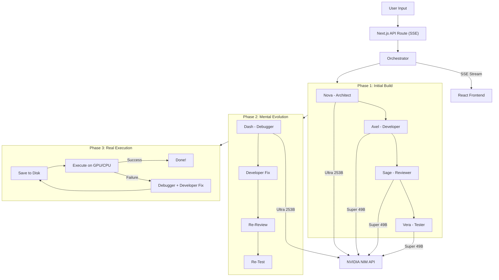

# NemoTeam — Self-Debugging Multi-Agent AI Dev Team

> 5 AI agents — each powered by the right **NVIDIA Nemotron** model for their role — collaborate in real-time to architect, code, review, test, **execute on real hardware**, and **auto-debug until the code runs successfully**. Powered by **NVIDIA NIM API**.

**#NVIDIAGTC**

---

## What is NemoTeam?

NemoTeam is an open-source multi-agent AI system where **five specialized Nemotron-powered agents** work together like a real engineering team — with a twist: **the system actually runs the code on your GPU and fixes its own bugs automatically**.

Each agent uses the NVIDIA Nemotron model best suited to its role:

| Agent | Role | Model | Why This Model |
|-------|------|-------|----------------|
| **Nova** (Architect) | Software Architect | `nvidia/llama-3.1-nemotron-ultra-253b-v1` | Flagship deep reasoning for system design |
| **Axel** (Developer) | Senior Developer | `nvidia/llama-3.3-nemotron-super-49b-v1` | Fast, efficient code generation |
| **Sage** (Reviewer) | Code Reviewer | `nvidia/llama-3.3-nemotron-super-49b-v1` | Fast, efficient analysis |
| **Vera** (Tester) | QA Engineer | `nvidia/llama-3.3-nemotron-super-49b-v1` | Quick test generation |
| **Dash** (Debugger) | Debug Engineer | `nvidia/llama-3.1-nemotron-ultra-253b-v1` | Deep root-cause analysis |

### The Pipeline (OpenEvolve-inspired, 3 Phases)

**Phase 1 — Initial Build:**
```
User Task → Architect → Developer → Reviewer → (Revision if needed) → Tester
```

**Phase 2 — Mental Evolution Loop (if tests fail, soft cap 10 cycles):**
```
Tester FAILS → Debugger diagnoses → Developer fixes → Reviewer re-checks → Tester re-tests
                                    ↑                                        ↓
                                    └──────── repeat until PASS ─────────────┘
```

**Phase 3 — Real Execution + Auto-Debug (Open Evolve — unlimited, tiered escalation):**
```
Save code → Execute on real hardware → Success? → Done!
                    ↓ (failure)
            Debugger audits ENTIRE code → Developer fixes ALL bugs → Re-execute
                    ↑                                                    ↓
                    └──── track errors, escalate if repeating ───────────┘
```

The system doesn't just write code — it **runs it**, catches real runtime errors, and keeps fixing until the code executes successfully. It even validates output quality: low accuracy, NaN values, GPU slower than CPU, or stuck training all trigger another debug cycle.

---

## Key Features

- **Multi-Model Architecture** — Different NVIDIA Nemotron models for different roles: Ultra-253B for deep reasoning agents (Architect, Debugger) and Super-49B for fast code generation and analysis (Developer, Reviewer, Tester). All via NVIDIA NIM.
- **Real Code Execution** — Generated code is saved to disk and executed on your actual hardware (GPU/CPU). Not just "looks correct" — it **runs correctly**.
- **Open Evolve Self-Debugging** — When code crashes, the real error output feeds back to the Debugger. It diagnoses the issue, the Developer fixes it, and it re-runs. No hard cap — the system escalates through three tiers (quick fix → deep review → full re-architecture) until the code works.
- **Output Quality Validation** — Even if code doesn't crash, the system checks for bad results: low training accuracy, NaN values, GPU slower than CPU, loss not decreasing. Bad results trigger auto-debug.
- **Multi-Bug Fix Per Round** — The Debugger audits the entire codebase each cycle, not just the crash line. Fixes multiple bugs at once instead of one-at-a-time.
- **Error Intelligence** — Tracks all errors (same and different) across attempts. If the same bug repeats, escalates to "try a completely different approach." If a new bug appears, warns "don't reintroduce the old one."
- **API Resilience** — Automatic retry with exponential backoff on NIM API rate-limits and transient errors. Demos don't crash on 429s.
- **Smart Context Management** — Conversations are automatically trimmed to fit model context windows. Preserves the architect's plan, latest code, and recent messages while summarizing older history.
- **Dynamic Environment Detection** — Auto-detects OS, Python version, GPU model, CUDA paths, and installed packages. Zero hardcoded values. Works on any machine.
- **Safe Auto Package Install** — Missing Python packages from a curated allowlist are automatically installed via pip during execution.
- **Real-Time Streaming** — Watch agents think and write live via Server-Sent Events.
- **CuPy/GPU Best Practices** — Agents are guided to use proper GPU timing (synchronization), vectorized operations, and numerically stable implementations.

---

## Demo Results

One prompt: *"Build a GPU computing showcase — matrix multiplication, FFT, Monte Carlo — GPU vs CPU"*

```
=== BENCHMARK RESULTS ===
Task                              GPU Time    CPU Time    Speedup
Matrix Multiplication (4096x4096) 0.38s       1.32s       3.5x
FFT (10M points)                  0.11s       1.24s       11.0x
Monte Carlo (5M paths)            0.08s       0.31s       3.8x
```

All running on a GTX 1080 Ti. Zero manual fixes. The code crashed multiple times during auto-debug, fixed itself, and delivered verified results.

---

## Architecture



---

## Multi-Model Strategy

NemoTeam uses a deliberate model-per-role strategy to balance quality and efficiency:

| Model | Agents | Rationale |
|-------|--------|-----------|
| **`nvidia/llama-3.1-nemotron-ultra-253b-v1`** | Nova (Architect), Dash (Debugger) | These agents need the deepest reasoning for system design and root-cause analysis. The Ultra 253B is NVIDIA's flagship model with superior scientific reasoning. |
| **`nvidia/llama-3.3-nemotron-super-49b-v1`** | Axel (Developer), Sage (Reviewer), Vera (Tester) | Code generation, review, and testing benefit from the Super-49B's high-efficiency reasoning and fast throughput, keeping the pipeline moving. |

Both models are accessed through a single NVIDIA NIM endpoint (`integrate.api.nvidia.com/v1`) using the OpenAI-compatible interface.

---

## Tech Stack

| Layer | Technology |
|-------|-----------|
| **Framework** | Next.js 15 (App Router) |
| **Language** | TypeScript (strict mode) |
| **Styling** | Tailwind CSS 4 + Custom CSS |
| **AI Models** | `nvidia/llama-3.1-nemotron-ultra-253b-v1` + `nvidia/llama-3.3-nemotron-super-49b-v1` |
| **AI API** | NVIDIA NIM (OpenAI-compatible) |
| **Streaming** | Server-Sent Events (SSE) |
| **Code Execution** | Async `child_process.exec` with dynamic CUDA environment |
| **Code Display** | react-syntax-highlighter (Prism) |
| **Icons** | Lucide React |

---

## Getting Started

### Prerequisites

- **Node.js** 18+ installed
- **Python** 3.10+ (for code execution)
- **NVIDIA GPU** + CuPy (optional, for GPU benchmarks)
- **NVIDIA NIM API Key** — Get one free at [build.nvidia.com](https://build.nvidia.com)

### Setup

1. **Clone the repository:**

```bash
git clone https://github.com/stanley1208/NemoTeam.git
cd NemoTeam
```

2. **Install dependencies:**

```bash
npm install
```

3. **Set up your API key:**

```bash
cp .env.example .env
```

Edit `.env` and add your NVIDIA NIM API key:

```
NVIDIA_NIM_API_KEY=nvapi-xxxxxxxxxxxxxxxxxxxxx
```

4. **Run the development server:**

```bash
npm run dev
```

5. **Open your browser** at [http://localhost:3000](http://localhost:3000)

### Optional: GPU Support

For GPU-accelerated code execution, install CuPy:

```bash
pip install cupy-cuda12x numpy
```

The system auto-detects your GPU and CUDA paths. No manual configuration needed.

---

## How It Works

1. **User submits a task** on the landing page
2. **Orchestrator** auto-detects system environment (OS, Python, GPU, packages)
3. **Phase 1** — Agents build the initial solution:
   - Architect designs (Ultra-253B) → Developer codes (Super-49B) → Reviewer audits (Super-49B) → Developer revises → Tester validates (Super-49B)
4. **Phase 2** — If mental tests fail, evolution loop runs:
   - Debugger diagnoses (Ultra-253B) → Developer fixes (Super-49B) → Reviewer re-checks (Super-49B) → Tester re-tests (Super-49B) — soft cap 10 cycles, then proceeds to real execution
5. **Phase 3** — Real execution with auto-debug:
   - Code saved to `output/` directory
   - Executed asynchronously on real hardware with CUDA environment
   - If crash: error fed to Debugger → full code audit → Developer fixes → re-execute
   - If bad output (low accuracy, NaN, etc.): flagged as failure → auto-debug
   - Tracks all errors, escalates on repeats, prevents bug regression
   - Open Evolve: unlimited retries with tiered escalation (quick fix → deep review → re-architecture)
6. **SSE Events** stream everything to the frontend in real-time

---

## Project Structure

```
src/
├── app/
│   ├── layout.tsx            # Root layout
│   ├── page.tsx              # Landing page
│   ├── globals.css           # Glassmorphism theme
│   ├── workspace/
│   │   └── page.tsx          # Main workspace (chat + code + execution results)
│   └── api/
│       └── agents/
│           └── route.ts      # SSE endpoint
├── components/
│   ├── Header.tsx            # Navigation bar (shows active models)
│   ├── TaskInput.tsx         # Task input with examples
│   ├── AgentChat.tsx         # Streaming agent messages
│   ├── AgentMessage.tsx      # Individual message rendering
│   ├── CodePanel.tsx         # Code display + execution results
│   ├── AgentAvatar.tsx       # Role-colored avatars
│   └── StatusBar.tsx         # Pipeline + model indicator + evolution progress
├── lib/
│   ├── agents.ts             # 5 agent definitions + model assignments + system prompts
│   ├── nemotron.ts           # NVIDIA NIM API client (multi-model, retry, backoff)
│   ├── orchestrator.ts       # 3-phase pipeline + async execution + auto-debug
│   └── utils.ts              # Utilities
└── types/
    └── index.ts              # TypeScript types
output/                       # Auto-generated code saved here
run_output.bat                # Manual execution helper (Windows)
```

---

## NVIDIA Technology Used

- **NVIDIA Nemotron Ultra 253B** (`nvidia/llama-3.1-nemotron-ultra-253b-v1`) — NVIDIA's flagship model, powers the Architect and Debugger agents for deep reasoning tasks
- **NVIDIA Nemotron Super 49B** (`nvidia/llama-3.3-nemotron-super-49b-v1`) — Powers the Reviewer and Tester agents for efficient analysis
- **NVIDIA NIM API** — Cloud inference with OpenAI-compatible interface, automatic retry with exponential backoff
- **CUDA / CuPy** — Real GPU execution of generated code with dynamic CUDA path detection
- Built for the **NVIDIA GTC 2026 Golden Ticket Developer Contest**

---

## Security Considerations

NemoTeam executes AI-generated code on the host machine. The following safeguards are in place:

- **Package allowlist** — Auto-install is restricted to a curated list of known-safe packages (numpy, torch, pandas, etc.)
- **Package name validation** — Package names are validated against a strict regex before pip install
- **Execution timeout** — All code execution has a 300-second timeout
- **Output buffer limits** — Execution output is capped at 1MB to prevent memory exhaustion

For production deployments, we recommend running code execution inside a Docker container or other sandbox.

---

## Contributing

Contributions are welcome! Feel free to:

1. Fork the repository
2. Create a feature branch (`git checkout -b feature/amazing-feature`)
3. Commit your changes (`git commit -m 'Add amazing feature'`)
4. Push to the branch (`git push origin feature/amazing-feature`)
5. Open a Pull Request

---

## License

MIT License. See [LICENSE](LICENSE) for details.

---

## Acknowledgments

- [NVIDIA](https://www.nvidia.com) for Nemotron models and the NIM API
- [NVIDIA GTC 2026](https://www.nvidia.com/gtc/) for inspiration
- [OpenEvolve](https://github.com/codelion/openevolve) for the self-evolving loop concept
- Built with [Next.js](https://nextjs.org), [Tailwind CSS](https://tailwindcss.com), and [Lucide](https://lucide.dev)
