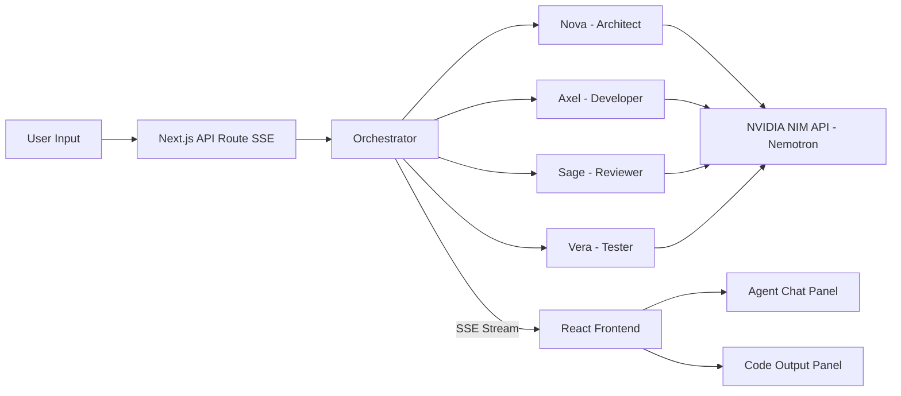

# NemoTeam — Multi-Agent AI Dev Team

> Watch specialized AI agents collaborate in real-time to architect, code, review, and test your software. Powered by **NVIDIA Nemotron** via the **NIM API**.

**#NVIDIAGTC**

---

## What is NemoTeam?

NemoTeam is an open-source multi-agent AI development tool where **four specialized Nemotron-powered agents** work together like a real software team:

| Agent | Role | What They Do |
|-------|------|--------------|
| **Nova** (Architect) | Software Architect | Analyzes tasks, designs system architecture, creates implementation plans |
| **Axel** (Developer) | Senior Developer | Writes clean, production-ready code based on the Architect's plan |
| **Sage** (Reviewer) | Code Reviewer | Audits code for bugs, security vulnerabilities, and quality issues |
| **Vera** (Tester) | QA Engineer | Writes comprehensive tests and validates correctness |
| **Dash** (Debugger) | Debug Engineer | Diagnoses test failures, traces root causes, and specifies precise fixes |

### The Pipeline (OpenEvolve-inspired)

**Phase 1 — Initial Build:**
```
User Task → Architect → Developer → Reviewer → (Revision if needed) → Tester
```

**Phase 2 — Evolution Loop (if tests fail):**
```
Tester FAILS → Debugger diagnoses → Developer fixes → Reviewer re-checks → Tester re-tests
                                    ↑                                        ↓
                                    └──────── repeat until PASS ─────────────┘
```

Inspired by [OpenEvolve](https://github.com/codelion/openevolve), the system doesn't stop at the first draft. If the Tester finds failures, the **Debugger** agent performs root cause analysis, then the team re-iterates through the fix-review-test cycle — up to 3 evolution cycles — until all tests pass. This is **vibe debugging**: the AI team keeps debugging itself until the code is clean.

---

## Architecture



---

## Key Features

- **Real-Time Streaming** — Watch agents think and write live via Server-Sent Events. Every reasoning step, every line of code, as it happens.
- **5-Agent Collaboration** — Five specialized agents with distinct roles and personalities, communicating through a shared context window.
- **Automatic Code Review** — The Reviewer agent catches bugs, security issues, and anti-patterns, triggering automatic revisions.
- **Self-Evolving Debug Loop** — Inspired by OpenEvolve: if tests fail, the Debugger diagnoses root causes and the team re-iterates (up to 3 cycles) until all tests pass.
- **Vibe Debugging** — The AI team keeps debugging itself autonomously — you just watch it work.
- **Beautiful Dark UI** — NVIDIA-branded dark theme with split-panel workspace, syntax highlighting, and smooth animations.
- **Mobile Responsive** — Full functionality on desktop and mobile with a tabbed interface on smaller screens.

---

## Tech Stack

| Layer | Technology |
|-------|-----------|
| **Framework** | Next.js 15 (App Router) |
| **Language** | TypeScript |
| **Styling** | Tailwind CSS 4 |
| **AI Model** | `mistralai/mistral-nemotron` |
| **AI API** | NVIDIA NIM (OpenAI-compatible) |
| **Streaming** | Server-Sent Events (SSE) |
| **Code Display** | react-syntax-highlighter |
| **Icons** | Lucide React |

---

## Getting Started

### Prerequisites

- **Node.js** 18+ installed
- **NVIDIA NIM API Key** — Get one free at [build.nvidia.com](https://build.nvidia.com)

### Setup

1. **Clone the repository:**

```bash
git clone https://github.com/YOUR_USERNAME/nemoteam.git
cd nemoteam
```

2. **Install dependencies:**

```bash
npm install
```

3. **Set up your API key:**

```bash
# Create a .env file (or .env.local)
cp .env.example .env
```

Edit `.env` and add your NVIDIA NIM API key:

```
NVIDIA_NIM_API_KEY=nvapi-xxxxxxxxxxxxxxxxxxxxx
```

4. **Run the development server:**

```bash
npm run dev
```

5. **Open your browser** at [http://localhost:3000](http://localhost:3000)

---

## Project Structure

```
src/
├── app/
│   ├── layout.tsx            # Root layout, dark theme
│   ├── page.tsx              # Landing page with hero + task input
│   ├── workspace/
│   │   └── page.tsx          # Main workspace (agent chat + code panel)
│   └── api/
│       └── agents/
│           └── route.ts      # SSE endpoint — runs the multi-agent pipeline
├── components/
│   ├── Header.tsx            # Top navigation bar
│   ├── TaskInput.tsx         # Task input with examples
│   ├── AgentChat.tsx         # Scrollable agent message feed
│   ├── AgentMessage.tsx      # Individual message with avatar + formatting
│   ├── CodePanel.tsx         # Syntax-highlighted code output
│   ├── AgentAvatar.tsx       # Role-colored avatar component
│   └── StatusBar.tsx         # Pipeline progress indicator
├── lib/
│   ├── agents.ts             # Agent definitions + system prompts
│   ├── nemotron.ts           # NVIDIA NIM API client
│   ├── orchestrator.ts       # Multi-agent workflow engine
│   └── utils.ts              # Utility functions
└── types/
    └── index.ts              # TypeScript type definitions
```

---

## How It Works (Technical)

1. **User submits a task** on the landing page or workspace
2. **Frontend** sends a POST request to `/api/agents` with the task description
3. **API Route** creates an SSE stream and starts the orchestrator
4. **Orchestrator** runs the two-phase pipeline:
   - **Phase 1 (Initial):** Architect → Developer → Reviewer → (Revision) → Tester
   - **Phase 2 (Evolution):** If Tester finds failures →
     Debugger diagnoses → Developer fixes → Reviewer re-checks → Tester re-tests.
     Repeats up to 3 evolution cycles until all tests pass.
5. **SSE Events** stream back to the frontend in real-time:
   - `agent_start` — a new agent begins working
   - `agent_chunk` — streaming text token
   - `agent_complete` — agent finished
   - `code_update` — new code block extracted
   - `evolution_cycle` — a new debug-fix-test cycle has started
   - `workflow_complete` — all agents done (with cycle count)
6. **Frontend** renders the live chat feed, updates the code panel, and shows evolution cycle progress

---

## NVIDIA Technology Used

- **NVIDIA Nemotron** (`llama-3.1-nemotron-70b-instruct`) — The core LLM powering all four agents
- **NVIDIA NIM API** — Cloud inference endpoint for accessing Nemotron with OpenAI-compatible interface
- Built for the **NVIDIA GTC 2026 Golden Ticket Developer Contest**

---

## Contributing

Contributions are welcome! Feel free to:

1. Fork the repository
2. Create a feature branch (`git checkout -b feature/amazing-feature`)
3. Commit your changes (`git commit -m 'Add amazing feature'`)
4. Push to the branch (`git push origin feature/amazing-feature`)
5. Open a Pull Request

---

## License

MIT License. See [LICENSE](LICENSE) for details.

---

## Acknowledgments

- [NVIDIA](https://www.nvidia.com) for Nemotron and the NIM API
- [NVIDIA GTC 2026](https://www.nvidia.com/gtc/) for inspiration
- Built with [Next.js](https://nextjs.org), [Tailwind CSS](https://tailwindcss.com), and [Lucide](https://lucide.dev)
